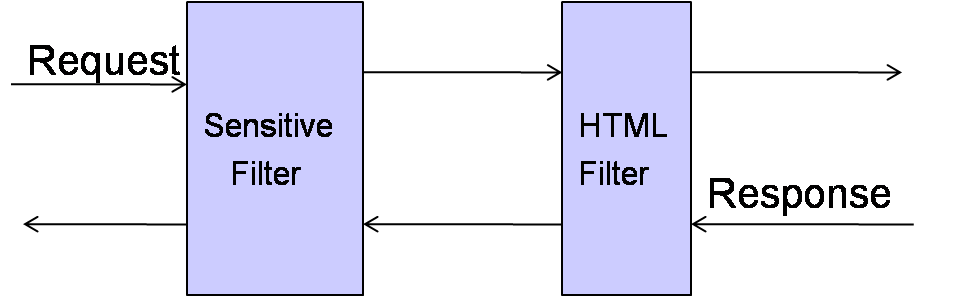

##ChainOfResponsibilityFilter责任链模式
责任链模式（Chain of Responsibility）的目标是使多个对象都有机会处理请求，从而避免请求的发送者和接收者之间的耦合关系。将这些对象连成一条链，并沿着这条链传递请求，直到有一个对象处理它为止。

在处理用户的请求时可能要根据不同的情况对请求添加不同的处理逻辑，在这时候就可以利用责任链进行设计。当需要添加一个处理逻辑时可以很方便的添加一个处理的节点。

##功能

* 处理用户的请求，将用户提交的字符串信息进行层层处理，同时在处理完成之后返回结果时，也要对返回的字符串进行层层处理，而处理返回的情况时其处理的顺序和先前是正好相反的顺序。
* 

##得出的结论
* FilterChain中继承了Filter接口，所以在测试类中就可以像使用其他的过滤器一样使用FilterChain，大大提高了灵活性；

* 对于实现责任链的访问处理顺序问题，该问题的解决使用的是递归的思想，从而使先调用的结点在处理返回结果时其调用过滤器的顺序是相反的。这种解决方案在Struts和其他框架中实现过滤器和拦截器使用的较为普遍，并且十分巧妙。